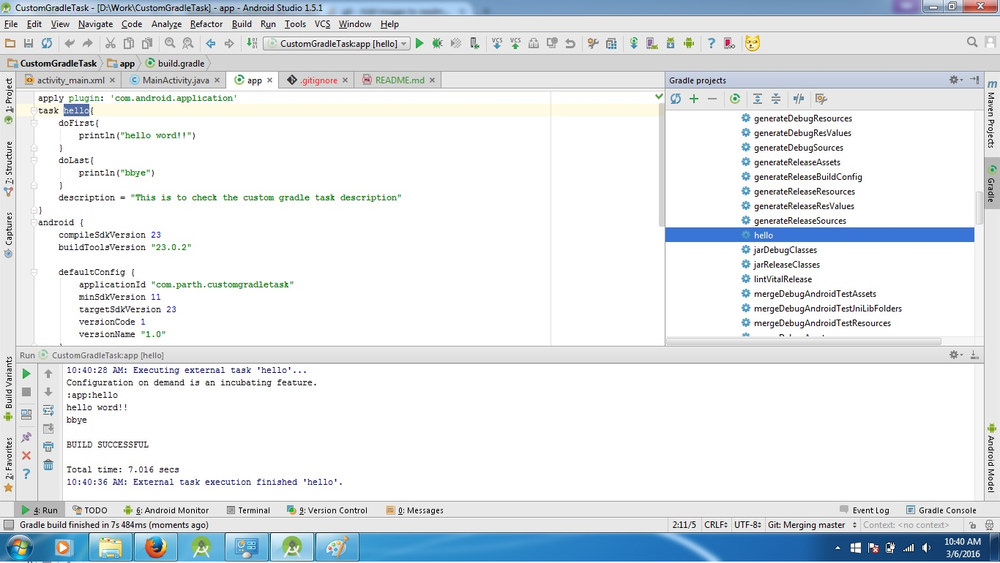

# CustomGradleTask
Android custom gradle task
Repository is for those who want to learn how to create a custom gradle tasks

Let's get started by creating one simple gradle task.
go to your project directory now if your for android then go to app directory and open build.gradle
and if your from JavaEE i think you just have one build.gradle (i don't know but open gradle that defines the dependencies)
now
type this

    task $task_name{
        // this is for what you want to do first
        doFirst{
    
        }
        //this is for what you want to do last in your task
        doLast{
    
        }
        //this is for describing the task to others that what it actually does
        description = "$your description"
    }
    

now i had created first custom task that you find in my commits, and for easy catch i will paste it here so you don't have to check all of my commits:

    task hello{
        doFirst{
            println("hello word!!")
        }
        doLast{
            println("bbye")
        }
        description = "This is to check the custom gradle task description"
    }

uptil now is good, but how the hack we are gonna run that?
well it's quite easy
go to gradle block and inside that your task will be found inside app -> tasks -> other (i'm using android studio so it is here if your using some other tool then check doc and i gradle commands are same so you can check like gradle task_name to execute the task)

if you want to check how many tasks are there type gradlew tasks in terminal( of course inside your app folder)
so inside that you will see the task with description

ok until now it's good, yah it's good but why do i need to find the task? can't we do something about that?
yes we can, as you can see in your gradle block that they are grouped together like android,build,install,other... so on so we can also do something like that.

type group for grouping the task.

    task hello {
        group "customTaskGroup"
        doFirst {
            println("hello word!!")
        }
        doLast {
            println("bbye")
        }
        description "This is to check the custom gradle task description"
    }

you probably thinking why i remove = from the task... because you don't need it (i don't remembered exact version when the updated but we are writing minSdkVersion = 23 and so on.. but now you don't need it.)

now , you probably thinking like ok, there is doFirst , and doLast but what about intermediate steps? what i need to do to just add block after the first but before something else like doLast?
well there is this chain process, what actually gradle sees is this:

    task -> ok this is the task that defind
     group -> now group this task
     doFirst -> now add this block of the code to do first in stack 
      doLast -> now add this block of the code at the end of the stack to execute
     
now if we just add one more doLast what will happen?
well it sees again like that

    task -> ok this is the task that defind
         group -> now group this task
         doFirst -> now add this block of the code to do first in stack 
          doLast -> now add this block of the code at the end of the stack to execute
          doLast -> now add this block of the code at the end of the stack to execute
          
so there you go you have one intermediate stage where you can do stuff that you need to do
it's just like stack or FIFO queue that execute this part of the code that part of the code then that part of the code but based on the first come first serve

so you have now is:

    task hello {
            group "customTaskGroup"
            //will be executed at the time of configuration
            println("Hello from Config stage")
            
            //execute after configuration
            doFirst {
                println("hello word!!")
            }
            doLast {
                println("bbye")
            }
             doLast {
                println("bbye")
             }
            description "This is to check the custom gradle task description"
        } << {
            println("just the same as gradle doLast")
        }
        
ok so what's this about execution phase and configuration phase?
well it's just like an object declaration , that constructor calls first and after that you configured all your initialization you will execute methods from that so what you will see in gradle console is:

    11:04:30 AM: Executing external task 'hello'...
    Configuration on demand is an incubating feature.
    Hello from Config stage
    :app:hello //started executing methods....
    hello word!!
    bbye
    bbye
    just the same as gradle doLast
    
    BUILD SUCCESSFUL
    
    Total time: 0.578 secs
    11:04:31 AM: External task execution finished 'hello'.
    
    
ok, so yah basically we can create the tasks... and run them but what we are going to archive from this?
well, it depends on what you want? if you want to do some smart work rather then hard work then this is the thing.
for example,

    1) you have some file called services which have api keys and api urls that you need to encrpt
      so what you gonna do encrpt every single urls and api keys from your own or you want to do stuff automatically?
      that hits the spot right? if we can encrpt every urls automatically that saves 10-15min of hardwork or even reduce your mistake like when you are in pressure or in distraction (:p) you forgot to encrpt urls and uploaded the apk... man that was the biggest problem right?
      so we can do something to avoid that mistakes.
      
    2) other thing is like when we release new build we want backup of the code, ok ok you probably thinking what's the big deal i mean we can do it too easily, but serisouly you need to ? just create a small that that do it for you. simple.
    
    so basically when you need to remove your hardwork and do work smartly this helps you to, that's the meaning of programming , to work smart right?
    
so , now we are moving to create a task that encrpts the urls if build version is "release"

    //to define the keys(variables) or we can say algorithms
    ext {
        KEY = "mysecretkey".padRight(16).getBytes("UTF-8")
        IV = "1234".padRight(16).getBytes("UTF-8")
        PROVIDER = "SunJCE"
        SERVERKEY = encrypt("urlToServer")
        println(SERVERKEY)
    }
    
    def encrypt(String stringToEncrypt) {
        SecretKeySpec key = new SecretKeySpec(KEY, "AES")
        Cipher cipher = Cipher.getInstance("AES/CBC/PKCS5Padding", PROVIDER)
        cipher.init(Cipher.ENCRYPT_MODE, key, new IvParameterSpec(IV))
        def encBytes = cipher.doFinal(stringToEncrypt.bytes)
        return encBytes
    }

so what i'm doing here is i'm defining the extenstion variable in which i am encrpting the url at run time when gradle builds
so i added this

     buildTypes {
            debug {
                buildConfigField "Byte[]", "ServerApiUrl", (""+SERVERKEY).replace("[","{").replace("]","}")
            }
            release {
                minifyEnabled false
                proguardFiles getDefaultProguardFile('proguard-android.txt'), 'proguard-rules.pro'
            }
        }
        
as you can see here is the byte array which will be placed in buildconfig file which can be accessible from anywhere in your project as i have used here  
    
    public class MainActivity extends AppCompatActivity {
    
        public Byte[] ServerApiUrl = BuildConfig.ServerApiUrl;
    
        @Override
        protected void onCreate(Bundle savedInstanceState) {
            super.onCreate(savedInstanceState);
            setContentView(R.layout.activity_main);
    
            System.out.println(ServerApiUrl);
        }
    }
    
so now what it's looks like let's check it out:

    package com.parth.customgradletask;
    
    public final class BuildConfig {
      public static final boolean DEBUG = Boolean.parseBoolean("true");
      public static final String APPLICATION_ID = "com.parth.customgradletask";
      public static final String BUILD_TYPE = "debug";
      public static final String FLAVOR = "";
      public static final int VERSION_CODE = 1;
      public static final String VERSION_NAME = "1.0";
      // Fields from build type: debug
      public static final Byte[] ServerApiUrl = {-101, -74, 84, 39, -91, 33, 90, 89, -32, 11, 65, 72, 54, -43, -103, 123};
    }

here is the BuildConfig file there you have your serverApiUrl bytes which are enrpted and you can use it in mainActivity same goes for that service file of your's which contains the methods to fetch or upload to api urls

i will find a better way to write this because in one project der will be 60-80 api calls (for product) and upload even better but till then if you find a better way ping me on my gmail account which is: parth.dave93@gmail.com

until then CYA...
you can check https://docs.gradle.org/current/dsl/org.gradle.api.Task.html for more details.